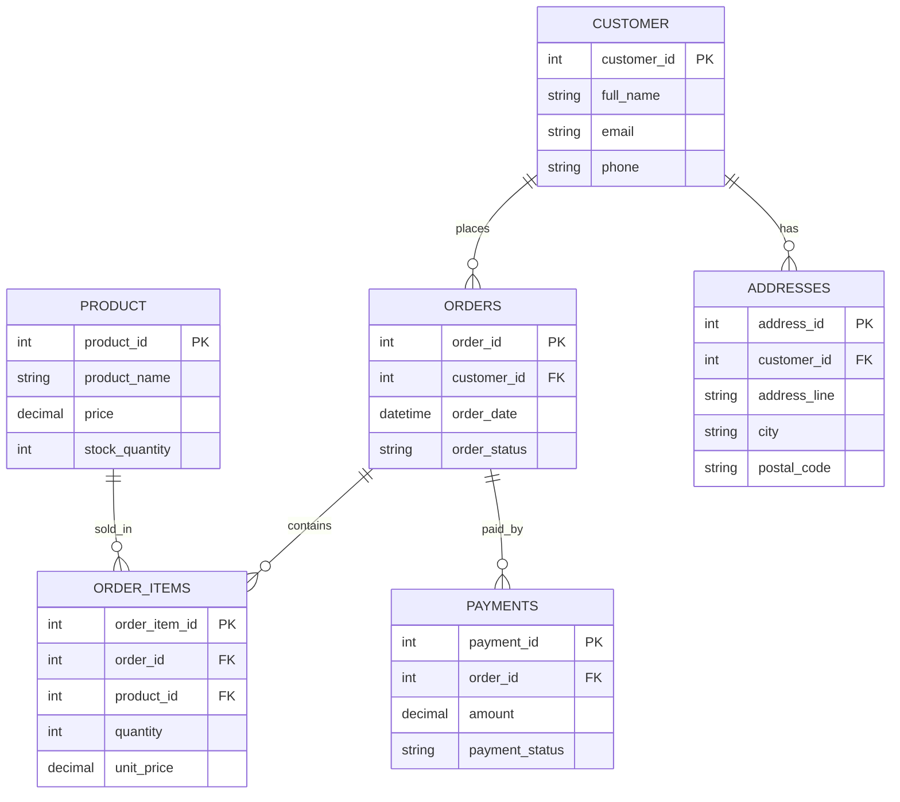

## Database Design (Real World)

Database design is the process of planning tables, relationships, constraints, and data flow so the database is correct, efficient, scalable and easy to maintain.

Good design prevents:
- duplicate data
- update anomalies
- orphan records
- poor query performance
- hard-to-maintain schemas


## 1. What Is Database Design?

- Database design means turning real-world business requirements into tables and relationships.
- It starts from understanding the problem domain, not from writing SQL immediately.
- A good design balances correctness, simplicity and performance.

Main goals:
- represent real business data accurately
- avoid redundancy where possible
- enforce integrity with constraints
- support common queries efficiently
- remain flexible for future changes


## 2. Levels of Database Design

### 2.1 Conceptual Design

- High-level business view.
- Focuses on entities and relationships.
- Usually represented with an ER diagram.

### 2.2 Logical Design

- Converts business entities into tables, columns, keys and relationships.
- Still technology-neutral in concept.

### 2.3 Physical Design

- Final MySQL implementation.
- Includes datatypes, indexes, partitions, storage choices and performance tuning.


## 3. Designing Schemas: Step-by-Step Process

### Step 1: Understand requirements

Ask:
- What objects exist in the business?
- What actions happen?
- What reports or queries are needed?
- What rules must be enforced?

### Step 2: Identify entities

Examples:
- Customer
- Order
- Product
- Doctor
- Patient
- Appointment
- Payment

### Step 3: Identify relationships

Examples:
- one customer places many orders
- one order has many order items
- one doctor sees many appointments
- one patient can have many visits

### Step 4: Define attributes

Choose columns that belong to each entity.

### Step 5: Choose primary keys

- Each table needs a unique identifier.
- Prefer stable keys that do not change frequently.

### Step 6: Define foreign keys

- Connect child tables to parent tables.
- Enforce referential integrity.

### Step 7: Normalize

- Reduce duplication and anomalies.
- Usually aim for 3NF for transactional systems.

### Step 8: Add constraints and indexes

- `NOT NULL`
- `UNIQUE`
- `CHECK`
- `DEFAULT`
- `FOREIGN KEY`
- indexes for frequent search/join columns

### Step 9: Review with real queries

- Does the design support the most common read/write patterns?
- Is it easy to maintain and extend?


## 4. ER Diagrams (Entity-Relationship Diagrams)

ER diagrams visually show:
- entities
- attributes
- relationships
- cardinality

### 4.1 Common ER Components

- Entity: a real-world object, like Customer or Doctor
- Attribute: a property, like name or email
- Primary key: unique identifier
- Relationship: how entities connect
- Cardinality: one-to-one, one-to-many, many-to-many

### 4.2 Cardinality Types

- One-to-One (1:1)
  - one row in A matches one row in B
- One-to-Many (1:N)
  - one row in A matches many rows in B
- Many-to-Many (M:N)
  - many rows in A match many rows in B
  - usually implemented using a junction table

### 4.3 Example ER Diagram (E-commerce)



This diagram shows a typical online shopping structure.


## 5. Core Schema Design Principles

### 5.1 Keep one concept per table

Each table should represent one major entity.

### 5.2 Use atomic columns

Do not store multiple values in one column.

Bad:
- `phone_numbers = '999,888,777'`

Good:
- separate row per phone number or separate related table

### 5.3 Avoid repeated groups

Example bad design:
- `product1`, `product2`, `product3`

Good design:
- separate `products` table and `order_items` table

### 5.4 Use stable keys

Prefer identifiers that do not change often.

### 5.5 Separate master data from transaction data

- Master data: customers, products, doctors, departments
- Transaction data: orders, visits, appointments, payments


### 5.6 Surrogate Key vs Natural Key

This is a very common interview concept.

- Surrogate key:
    - system-generated identifier
    - usually an `INT AUTO_INCREMENT` or UUID-style key
    - has no business meaning

- Natural key:
    - a real-world attribute that uniquely identifies the row
    - example: email, ISBN, national ID, SKU

Practical guidance:
- use surrogate keys for internal row identity
- use natural keys only when they are stable and truly unique

Example:
```sql
CREATE TABLE customers (
        customer_id INT PRIMARY KEY AUTO_INCREMENT, -- surrogate key
        email VARCHAR(150) NOT NULL UNIQUE           -- natural key candidate
);
```


### 5.7 Soft Delete vs Hard Delete

Soft delete:
- row is not physically removed
- a flag like `is_deleted` or `deleted_at` marks it inactive
- useful for recovery and auditability

Hard delete:
- row is physically removed with `DELETE`
- useful when data should truly disappear

Example soft delete:
```sql
CREATE TABLE products (
        product_id INT PRIMARY KEY AUTO_INCREMENT,
        product_name VARCHAR(150) NOT NULL,
        is_deleted TINYINT NOT NULL DEFAULT 0,
        deleted_at DATETIME NULL
);
```

Soft delete update:
```sql
UPDATE products
SET is_deleted = 1,
        deleted_at = NOW()
WHERE product_id = 10;
```


### 5.8 Audit Columns (Standard Practice)

Audit columns are common in real systems.

Typical audit columns:
- `created_at`
- `updated_at`
- `created_by`
- `updated_by`
- `deleted_at` (if using soft delete)

Example:
```sql
CREATE TABLE orders (
        order_id INT PRIMARY KEY AUTO_INCREMENT,
        customer_id INT NOT NULL,
        order_status VARCHAR(20) NOT NULL DEFAULT 'PENDING',
        created_at DATETIME NOT NULL DEFAULT CURRENT_TIMESTAMP,
        updated_at DATETIME NULL ON UPDATE CURRENT_TIMESTAMP,
        created_by INT,
        updated_by INT
);
```


## 6. Denormalization (Explicit Section)

Denormalization means intentionally adding some redundancy to improve read performance or simplify queries.

Why it is used:
- reduce joins in reporting queries
- speed up read-heavy workloads
- simplify common screen queries

Tradeoff:
- faster reads
- harder writes and more risk of inconsistency

Example:
- storing `customer_name` in `orders` for reporting convenience, even though it also exists in `customers`

Use denormalization carefully and only when there is a real performance or reporting need.


## 7. Naming Conventions

Good naming makes designs easier to maintain.

Recommended patterns:
- tables: plural nouns or consistent singular nouns
- primary keys: `table_id`
- foreign keys: `related_table_id`
- junction tables: combine table names, like `order_items`
- constraints: `pk_`, `fk_`, `uq_`, `chk_`
- indexes: `idx_<table>_<columns>`

Examples:
- `customers`
- `customer_id`
- `fk_orders_customer`
- `idx_orders_customer_date`


## 8. Sharding / Partitioning (1–2 Lines)

- Partitioning splits one table into internal segments inside the same MySQL server.
- Sharding splits data across multiple servers when a single database cannot handle the scale.


## 9. Normalization in Real Design

Normalization helps reduce redundancy.

### 6.1 1NF

- each cell contains a single value
- no repeating groups

### 6.2 2NF

- no partial dependency on a composite key

### 6.3 3NF

- no transitive dependency
- non-key columns should depend only on the key

### Practical balance

Sometimes limited denormalization is used for performance, but only after understanding the tradeoff.


## 10. Constraints in Database Design

Constraints protect the design from bad data.

Important ones:
- `PRIMARY KEY`
- `FOREIGN KEY`
- `NOT NULL`
- `UNIQUE`
- `CHECK`
- `DEFAULT`

Example:
```sql
CREATE TABLE customers (
    customer_id INT PRIMARY KEY,
    full_name VARCHAR(100) NOT NULL,
    email VARCHAR(150) NOT NULL UNIQUE,
    phone VARCHAR(20) UNIQUE,
    created_at TIMESTAMP NOT NULL DEFAULT CURRENT_TIMESTAMP
);
```


## 11. Indexing in Schema Design

Indexes should be planned with the schema.

Index columns commonly used in:
- `JOIN`
- `WHERE`
- `ORDER BY`
- reporting filters

Example:
```sql
CREATE INDEX idx_orders_customer_date
ON orders(customer_id, order_date);
```

Important:
- do not over-index
- each index helps reads but adds write cost


## 12. Real Query Examples

These examples show why the schema design choices matter.

### 12.1 Customer order history

```sql
SELECT c.customer_id,
       c.full_name,
       o.order_id,
       o.order_date,
       o.order_status,
       o.total_amount
FROM customers c
JOIN orders o ON o.customer_id = c.customer_id
WHERE c.customer_id = 101
ORDER BY o.order_date DESC;
```

### 12.2 Order detail with items

```sql
SELECT o.order_id,
       o.order_date,
       p.product_name,
       oi.quantity,
       oi.unit_price,
       (oi.quantity * oi.unit_price) AS line_total
FROM orders o
JOIN order_items oi ON oi.order_id = o.order_id
JOIN products p ON p.product_id = oi.product_id
WHERE o.order_id = 5001;
```

### 12.3 Doctor appointment schedule

```sql
SELECT a.appointment_id,
       a.appointment_date,
       p.full_name AS patient_name,
       d.full_name AS doctor_name,
       a.appointment_status
FROM appointments a
JOIN patients p ON p.patient_id = a.patient_id
JOIN doctors d ON d.doctor_id = a.doctor_id
WHERE d.doctor_id = 12
ORDER BY a.appointment_date;
```


## 13. Real Example: E-commerce Database Design

### 9.1 Business Requirements

- customers register and place orders
- customers may have multiple addresses
- orders contain multiple products
- payments are recorded for orders
- stock must be tracked

### 9.2 Core Tables

#### customers
```sql
CREATE TABLE customers (
    customer_id INT PRIMARY KEY AUTO_INCREMENT,
    full_name VARCHAR(100) NOT NULL,
    email VARCHAR(150) NOT NULL UNIQUE,
    phone VARCHAR(20) UNIQUE,
    created_at TIMESTAMP NOT NULL DEFAULT CURRENT_TIMESTAMP
);
```

#### addresses
```sql
CREATE TABLE addresses (
    address_id INT PRIMARY KEY AUTO_INCREMENT,
    customer_id INT NOT NULL,
    address_line VARCHAR(255) NOT NULL,
    city VARCHAR(100) NOT NULL,
    state VARCHAR(100),
    postal_code VARCHAR(20),
    is_default TINYINT NOT NULL DEFAULT 0,
    CONSTRAINT fk_addresses_customer
        FOREIGN KEY (customer_id)
        REFERENCES customers(customer_id)
        ON DELETE CASCADE
);
```

#### products
```sql
CREATE TABLE products (
    product_id INT PRIMARY KEY AUTO_INCREMENT,
    product_name VARCHAR(150) NOT NULL,
    price DECIMAL(10,2) NOT NULL CHECK (price > 0),
    stock_quantity INT NOT NULL CHECK (stock_quantity >= 0),
    is_active TINYINT NOT NULL DEFAULT 1
);
```

#### orders
```sql
CREATE TABLE orders (
    order_id INT PRIMARY KEY AUTO_INCREMENT,
    customer_id INT NOT NULL,
    shipping_address_id INT NOT NULL,
    order_date DATETIME NOT NULL DEFAULT CURRENT_TIMESTAMP,
    order_status VARCHAR(20) NOT NULL DEFAULT 'PENDING',
    total_amount DECIMAL(12,2) NOT NULL DEFAULT 0,
    CONSTRAINT fk_orders_customer
        FOREIGN KEY (customer_id)
        REFERENCES customers(customer_id),
    CONSTRAINT fk_orders_address
        FOREIGN KEY (shipping_address_id)
        REFERENCES addresses(address_id)
);
```

#### order_items
```sql
CREATE TABLE order_items (
    order_item_id INT PRIMARY KEY AUTO_INCREMENT,
    order_id INT NOT NULL,
    product_id INT NOT NULL,
    quantity INT NOT NULL CHECK (quantity > 0),
    unit_price DECIMAL(10,2) NOT NULL CHECK (unit_price > 0),
    CONSTRAINT fk_order_items_order
        FOREIGN KEY (order_id)
        REFERENCES orders(order_id)
        ON DELETE CASCADE,
    CONSTRAINT fk_order_items_product
        FOREIGN KEY (product_id)
        REFERENCES products(product_id)
);
```

#### payments
```sql
CREATE TABLE payments (
    payment_id INT PRIMARY KEY AUTO_INCREMENT,
    order_id INT NOT NULL,
    payment_method VARCHAR(30) NOT NULL,
    payment_status VARCHAR(20) NOT NULL DEFAULT 'PENDING',
    amount DECIMAL(12,2) NOT NULL CHECK (amount > 0),
    paid_at DATETIME,
    CONSTRAINT fk_payments_order
        FOREIGN KEY (order_id)
        REFERENCES orders(order_id)
        ON DELETE CASCADE
);
```

### 9.3 Why this design works

- Customers are stored once.
- Each order belongs to one customer.
- One order can have many items.
- Payments are tied to orders.
- Addresses are separated from customers for flexibility.
- Constraints protect integrity.

### 9.4 Common queries supported

- customer order history
- order details with items
- product stock tracking
- payment status reports
- default shipping address lookup


## 14. Real Example: Hospital Database Design

### 10.1 Business Requirements

- patients register once
- doctors belong to departments
- appointments connect patients and doctors
- visits may create prescriptions and diagnoses
- billing is linked to visits

### 10.2 Core Tables

#### patients
```sql
CREATE TABLE patients (
    patient_id INT PRIMARY KEY AUTO_INCREMENT,
    full_name VARCHAR(100) NOT NULL,
    dob DATE NOT NULL,
    gender VARCHAR(10) NOT NULL,
    phone VARCHAR(20) NOT NULL UNIQUE,
    email VARCHAR(150) UNIQUE,
    created_at TIMESTAMP NOT NULL DEFAULT CURRENT_TIMESTAMP
);
```

#### departments
```sql
CREATE TABLE departments (
    department_id INT PRIMARY KEY AUTO_INCREMENT,
    department_name VARCHAR(100) NOT NULL UNIQUE
);
```

#### doctors
```sql
CREATE TABLE doctors (
    doctor_id INT PRIMARY KEY AUTO_INCREMENT,
    full_name VARCHAR(100) NOT NULL,
    department_id INT NOT NULL,
    specialization VARCHAR(100) NOT NULL,
    phone VARCHAR(20) NOT NULL UNIQUE,
    CONSTRAINT fk_doctors_department
        FOREIGN KEY (department_id)
        REFERENCES departments(department_id)
);
```

#### appointments
```sql
CREATE TABLE appointments (
    appointment_id INT PRIMARY KEY AUTO_INCREMENT,
    patient_id INT NOT NULL,
    doctor_id INT NOT NULL,
    appointment_date DATETIME NOT NULL,
    appointment_status VARCHAR(20) NOT NULL DEFAULT 'SCHEDULED',
    CONSTRAINT fk_appointments_patient
        FOREIGN KEY (patient_id)
        REFERENCES patients(patient_id),
    CONSTRAINT fk_appointments_doctor
        FOREIGN KEY (doctor_id)
        REFERENCES doctors(doctor_id)
);
```

#### visits
```sql
CREATE TABLE visits (
    visit_id INT PRIMARY KEY AUTO_INCREMENT,
    appointment_id INT NOT NULL UNIQUE,
    diagnosis TEXT,
    notes TEXT,
    visit_date DATETIME NOT NULL DEFAULT CURRENT_TIMESTAMP,
    CONSTRAINT fk_visits_appointment
        FOREIGN KEY (appointment_id)
        REFERENCES appointments(appointment_id)
        ON DELETE CASCADE
);
```

#### prescriptions
```sql
CREATE TABLE prescriptions (
    prescription_id INT PRIMARY KEY AUTO_INCREMENT,
    visit_id INT NOT NULL,
    medicine_name VARCHAR(150) NOT NULL,
    dosage VARCHAR(100) NOT NULL,
    duration_days INT NOT NULL CHECK (duration_days > 0),
    CONSTRAINT fk_prescriptions_visit
        FOREIGN KEY (visit_id)
        REFERENCES visits(visit_id)
        ON DELETE CASCADE
);
```

### 10.3 Why this design works

- Patients, doctors, departments and visits are separated.
- Appointments prevent duplicate scheduling structure.
- Visits capture medical outcome.
- Prescriptions are connected to visits.
- Strict constraints help protect sensitive healthcare data.

### 10.4 Typical hospital queries

- patient visit history
- doctor appointment schedule
- department-wise doctor list
- active prescriptions for a visit
- billing and treatment tracking


## 15. Many-to-Many Relationships

A many-to-many relationship is never stored directly in a normalized design.

Instead, use a junction table.

Example:
- one order has many products
- one product can appear in many orders

Use:
- `order_items(order_id, product_id, quantity, unit_price)`

This is one of the most important schema design patterns.


## 16. Design Mistakes to Avoid

- Putting too many unrelated fields in one table.
- Storing repeated values in one column.
- Ignoring foreign keys and referential integrity.
- Using vague table names.
- Choosing poor datatypes.
- Forgetting indexes on search/join columns.
- Over-normalizing to the point of difficult querying.
- Under-normalizing and creating duplicate data everywhere.


## 17. Datatype Selection in Design

Choose types carefully:
- `INT` for identifiers and counts
- `VARCHAR` for text that varies in length
- `DATE` for dates without time
- `DATETIME` or `TIMESTAMP` for events in time
- `DECIMAL` for money
- `TINYINT` or `BOOLEAN`-like fields for flags

Avoid using floating-point types for money.


## 18. Designing for Performance

A good design is not only correct, but also query-friendly.

Tips:
- index foreign keys
- index high-usage filter columns
- choose composite indexes that match real queries
- avoid unnecessary wide rows
- separate large optional text/blob fields if needed
- use summary tables if reporting becomes expensive


## 19. Designing for Security and Compliance

For sensitive systems:
- separate personally identifiable data if necessary
- restrict access with views and permissions
- avoid storing sensitive data unless required
- use audit tables for critical operations
- apply least privilege access

Examples:
- hospital records
- payment records
- employee salary data


## 20. Real-World Design Checklist

Before finalizing a schema, ask:
- Does every table represent one concept?
- Are primary keys stable and unique?
- Are relationships modeled correctly?
- Have I normalized enough?
- Are constraints protecting business rules?
- Are important query columns indexed?
- Can the design grow as data volume increases?
- Are there any duplicate or redundant fields?


## 21. Quick Interview Notes

- Database design converts business requirements into tables and relationships.
- ER diagrams show entities, attributes and cardinality.
- Many-to-many relationships need junction tables.
- Normalization reduces redundancy and anomalies.
- Constraints and indexes are part of good schema design.
- Real-world schemas must balance correctness, performance and maintainability.


## 22. Final Summary

- Good database design is the foundation of reliable applications.
- Start from business rules and ER modeling, then build normalized tables.
- Use constraints to protect data and indexes to support access patterns.
- E-commerce and hospital systems are strong real-world examples of relational design.
- Strong schema design saves time, prevents bugs and improves long-term scalability.
